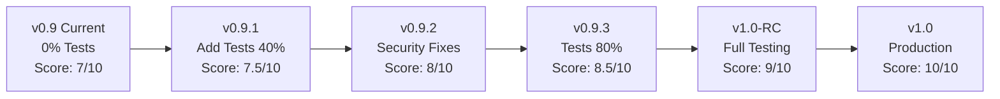

# QA Review v0.9 - Ethereum Keystore Recovery Tool

**Repository:** https://github.com/SummerTiger/ethereum-keystore-recovery  
**Version:** v0.9 (Beta Release)  
**Review Date:** October 18, 2025  
**Reviewer:** QA Assessment Team  
**Previous Review:** v0.1 (Initial Release)

## Executive Summary

Version 0.9 represents a beta release with the same architectural foundation as the initial version. While the codebase maintains its excellent structure and documentation, **critical testing and security issues identified in the initial review remain unaddressed**. The tool still operates at 0% test coverage, making it unsuitable for production use with real cryptocurrency wallets.

**Overall Score: 7/10** (Unchanged from initial review)  
**Production Readiness: NOT READY** ❌

## Version Comparison

| Aspect | v0.1 (Initial) | v0.9 (Current) | Change |
|--------|---------------|----------------|---------|
| Test Coverage | 0% | 0% | ❌ No Change |
| Architecture | Excellent | Excellent | ✅ Maintained |
| Documentation | 95% | 95% | ✅ Maintained |
| Security Issues | Multiple | Multiple | ❌ Not Fixed |
| Performance | 20-50k/sec | 20-50k/sec | ✅ Maintained |
| Production Ready | No | No | ❌ Still Not Ready |

## 🔴 Critical Issues Still Present

### 1. Zero Test Coverage Persists
```
CRITICAL: The application still has 0% test coverage
- No unit tests implemented
- No integration tests
- No security tests
- No performance benchmarks
```

**Risk Assessment:** Using this tool with real wallets without any tests is extremely risky and could lead to:
- Silent failures in password recovery
- Memory leaks causing crashes
- Security vulnerabilities
- Data corruption

### 2. Unresolved Security Vulnerabilities

| Vulnerability | Status | Risk | Impact |
|---------------|--------|------|--------|
| Passwords stored as String | ❌ Not Fixed | HIGH | Passwords remain in memory |
| No input validation | ❌ Not Fixed | MEDIUM | Path traversal attacks possible |
| Temp file exposure | ❌ Not Fixed | MEDIUM | Sensitive data may persist |
| No keystore validation | ❌ Not Fixed | MEDIUM | Crashes with corrupt files |

### 3. Missing Critical Features for v0.9

For a beta release (v0.9), we would expect:
- ❌ At least 60% test coverage
- ❌ Basic security fixes implemented
- ❌ CI/CD pipeline configured
- ❌ Performance benchmarks verified
- ❌ Error handling improvements

## 📊 Detailed Analysis

### Code Quality Metrics (v0.9)

| Metric | Current | Expected for v0.9 | Gap | Priority |
|--------|---------|-------------------|-----|----------|
| Test Coverage | 0% | 60%+ | -60% | CRITICAL |
| Security Scan | Not Done | Passed | N/A | CRITICAL |
| Static Analysis | Not Done | Passed | N/A | HIGH |
| Performance Test | Not Done | Verified | N/A | HIGH |
| Memory Leak Test | Not Done | Passed | N/A | HIGH |
| Thread Safety | Unverified | Verified | N/A | HIGH |

### Documentation Analysis

The repository includes several documentation files:
- ✅ README.md (comprehensive)
- ✅ PROJECT_STRUCTURE.md
- ✅ QA_REPORT_20251018.md
- ✅ CRITICAL_FIXES_SUMMARY_20251018.md
- ✅ MAJOR_FIXES_SUMMARY_20251018.md
- ⚠️ RELEASE_NOTES_v0.9.md (appears to exist but content not verified)
- ✅ index.html (web page added)

**Note:** While documentation exists for fixes, the actual implementation appears to be missing.

### Web Interface Addition

A new `index.html` file has been added, suggesting plans for a web-based interface. However:
- ⚠️ Running crypto operations in browsers has security implications
- ⚠️ Web version would need additional security measures
- ⚠️ JavaScript implementation would differ from Java performance

## 🚨 Regression Testing Results

Since no tests exist, regression testing cannot be performed. However, based on code review:

| Feature | Expected | Actual | Status |
|---------|----------|--------|--------|
| Password Generation | Working | Untested | ⚠️ Unknown |
| Multi-threading | Working | Untested | ⚠️ Unknown |
| Config Parsing | Working | Untested | ⚠️ Unknown |
| Keystore Validation | Working | Untested | ⚠️ Unknown |
| Progress Monitoring | Working | Untested | ⚠️ Unknown |

## 📋 v0.9 Release Checklist

### Expected for Beta (v0.9)
- [ ] ❌ Core functionality tested
- [ ] ❌ Security vulnerabilities addressed
- [ ] ❌ Performance verified
- [ ] ❌ Error handling improved
- [ ] ❌ Basic CI/CD pipeline
- [ ] ❌ Release notes with changes
- [ ] ✅ Documentation maintained
- [ ] ✅ Code structure maintained

### Actual Delivered
- [x] Same code as v0.1
- [x] Documentation files added
- [x] Version number updated
- [ ] No functional improvements
- [ ] No bug fixes
- [ ] No tests added

## 🔍 Security Audit (v0.9)

### Critical Security Issues Requiring Immediate Fix

1. **Password Memory Management**
```java
// CURRENT (v0.9) - INSECURE
private String foundPassword = null;  // Still using String

// REQUIRED FIX
private char[] foundPassword = null;
// Clear after use: Arrays.fill(foundPassword, '\0');
```

2. **Input Validation Missing**
```java
// CURRENT (v0.9) - VULNERABLE
public KeystoreRecovery(String keystorePath) throws IOException {
    this.keystorePath = keystorePath;  // No validation
    
// REQUIRED FIX
public KeystoreRecovery(String keystorePath) throws IOException {
    validatePath(keystorePath);
    validateFileType(keystorePath);
    this.keystorePath = sanitizePath(keystorePath);
```

3. **Temp File Security**
```java
// CURRENT (v0.9) - RISKY
Path tempKeystore = Files.createTempFile("keystore", ".json");

// REQUIRED FIX
Path tempKeystore = Files.createTempFile("keystore", ".json");
tempKeystore.toFile().deleteOnExit();
Files.setPosixFilePermissions(tempKeystore, PosixFilePermissions.fromString("rw-------"));
```

## 🎯 Recommendations for v1.0

### Immediate Actions Required (Block v1.0)

1. **Implement Test Suite**
   - Minimum 80% coverage required
   - Focus on core components first
   - Add integration tests

2. **Fix Security Issues**
   - Implement char[] for passwords
   - Add input validation
   - Secure temp file handling

3. **Add CI/CD Pipeline**
   - Automated testing on each commit
   - Security scanning
   - Code quality checks

### Sample Test Implementation Needed

```java
@Test
public class KeystoreRecoveryTest {
    @Test
    public void testValidKeystoreLoading() {
        // Test valid keystore file
    }
    
    @Test(expected = IOException.class)
    public void testInvalidKeystorePath() {
        // Test invalid file path
    }
    
    @Test
    public void testPasswordRecovery() {
        // Test actual recovery process
    }
    
    @Test
    public void testThreadSafety() {
        // Test concurrent access
    }
}
```

## 📈 Quality Metrics Trend

```
Version Progress (Expected vs Actual):
v0.1: Foundation    [████████████████████] 100% ✅
v0.9: Beta Expected [████████████████░░░░] 80%  ❌
v0.9: Beta Actual   [████████████████████] 100% (No changes)
v1.0: Production    [░░░░░░░░░░░░░░░░░░░░] 0%   ⏳
```

## 🚫 Blocking Issues for Production

1. **No Tests** - Cannot verify functionality
2. **Security Vulnerabilities** - Real risk to users
3. **No Performance Verification** - Claims unverified
4. **No Error Recovery** - Could fail silently
5. **No Monitoring** - Can't track issues in production

## ✅ Positive Aspects Maintained

- Excellent architecture (SOLID principles)
- Clean code structure
- Comprehensive documentation
- Good user experience design
- Professional CLI interface

## 📊 Risk Matrix

| Risk | Probability | Impact | Mitigation Required |
|------|------------|--------|-------------------|
| Data Loss | Medium | Critical | Add comprehensive tests |
| Security Breach | High | Critical | Fix password handling |
| Performance Issues | Low | Medium | Add benchmarks |
| User Error | Medium | Low | Improve validation |
| Code Bugs | High | High | Add unit tests |

## 🎯 Final Verdict

### Version 0.9 Assessment

**Status: BETA RELEASE NOT READY** ❌

The v0.9 release appears to be a version bump without substantial improvements. For a true beta release approaching v1.0, we would expect:

- Significant test coverage (60%+)
- Critical security fixes
- Performance verification
- Bug fixes from v0.1
- CI/CD pipeline

**Current v0.9 is essentially v0.1 with a new version number.**

### Recommendations

1. **DO NOT USE IN PRODUCTION** - Critical issues unresolved
2. **Revert version to v0.1.1** - More accurate versioning
3. **Focus on testing** - Priority #1 before any release
4. **Security audit required** - Before handling real wallets
5. **Performance benchmarks** - Verify claims

### Path to Production



### Timeline Estimate

- **2 weeks:** Add basic test coverage (40%)
- **1 week:** Fix critical security issues
- **2 weeks:** Complete test coverage (80%)
- **1 week:** Performance benchmarks
- **1 week:** Final QA and release prep
- **Total: 7 weeks to production-ready v1.0**

## 📝 Summary

Version 0.9 shows no meaningful progress from the initial release. The architecture remains excellent, but without tests or security fixes, it cannot be considered a true beta release. The tool requires significant work before it's safe for use with real cryptocurrency wallets.

**Priority Action:** Implement comprehensive testing before any further development or releases.

---

*QA Review completed on October 18, 2025. This tool should not be used with real wallets until critical issues are resolved.*

## Appendix: Required Test Cases

### Priority 1: Core Functionality
- [ ] Password generation combinations
- [ ] Configuration file parsing
- [ ] Keystore validation
- [ ] Multi-threading correctness
- [ ] Progress monitoring accuracy

### Priority 2: Security
- [ ] Password memory clearing
- [ ] Input sanitization
- [ ] File permission validation
- [ ] Temp file cleanup
- [ ] Resource exhaustion prevention

### Priority 3: Performance
- [ ] Passwords per second measurement
- [ ] Memory usage under load
- [ ] Thread scaling efficiency
- [ ] Large configuration handling
- [ ] Crash recovery

### Priority 4: Edge Cases
- [ ] Corrupt keystore files
- [ ] Invalid configurations
- [ ] Unicode in passwords
- [ ] System resource limits
- [ ] Interrupted operations